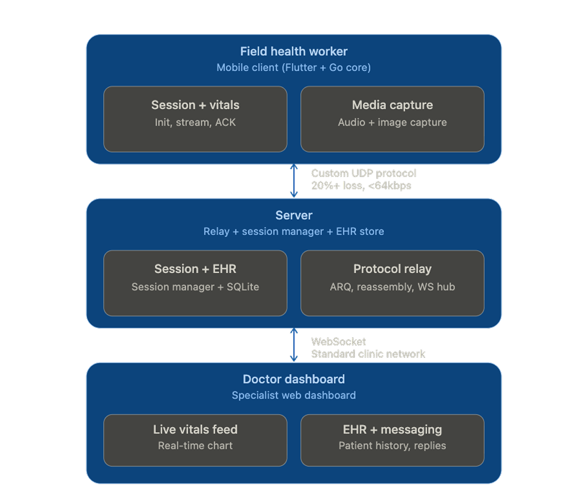
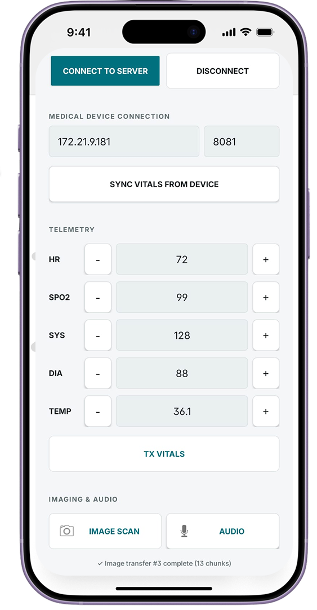
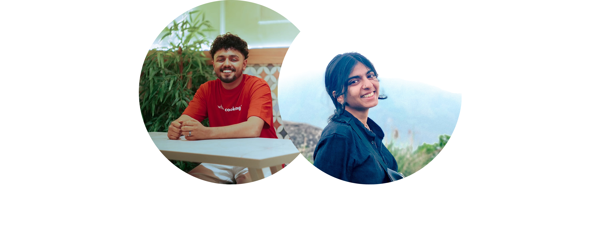

<div align="center">
  
  <h1>VitalLink</h1>
  <p><strong>Signal Through the Noise</strong><br>
  Reliable medical telemetry for the world's most constrained networks.</p>
</div>

---

## 🚨 The Problem

Millions of people receive emergency medical care far from any hospital. Field health workers have the training and equipment, but no reliable link to specialists who can save lives. Traditional protocols fail under extreme rural network conditions. Under 20% packet loss and a 64kbps bandwidth cap, standard HTTP clients hang, timeout, and fail to deliver critical vitals.

## 💡 The Solution

**VitalLink** is built assuming the network is hostile. It is a purpose-built telemetry system designed to survive extreme degradation, ensuring that a field worker's data reaches the doctor's dashboard.

Using a custom UDP protocol with selective-repeat ARQ, VitalLink prioritizes **freshness over completeness** for vitals, while guaranteeing essential delivery for patient context and media.

### Key Features

- **Custom ARQ Protocol:** Retransmits only what was lost. If a vitals packet is too old, it is dropped in favor of current readings.
- **Offline Buffering & Session Persistence:** Vitals are buffered securely if connectivity reaches zero, and replay immediately when the link returns. Server crashes do not drop active field sessions.
- **EHR Auto-Push:** The moment a session connects, the patient's full medical history is pushed automatically to the specialist.
- **Secure Transport:** AES-256-GCM encryption on the UDP link and HMAC authenticated handshakes.
- **Silent Edge-Case Recovery:** Suppresses corrupted packets, handles out-of-order delivery, and progressively reassembles chunked media under heavy loss.

---

## 🏗️ Architecture

VitalLink scopes its resilience engineering specifically to the **Field Worker ↔ Server** link, where extreme network conditions exist. The **Server ↔ Doctor** link runs on standard clinic infrastructure using WebSockets.

<div align="center">
  
</div>

```mermaid
flowchart LR
    %% Define Styles
    classDef hardware fill:#00707F,stroke:#090A0C,stroke-width:2px,color:#fff,rx:5px,ry:5px;
    classDef mobile fill:#10181B,stroke:#00707F,stroke-width:2px,color:#fff,rx:10px,ry:10px;
    classDef server fill:#455A64,stroke:#090A0C,stroke-width:2px,color:#fff,rx:5px,ry:5px;
    classDef doctor fill:#F4F6F7,stroke:#00707F,stroke-width:2px,color:#10181B,rx:10px,ry:10px;

    %% Nodes
    subgraph Edge ["Edge / Field"]
        HW[Hardware Medical Devices\n(ECG, Pulse Ox, BP)]:::hardware
        App[VitalLink Mobile App\n(Android / Pi Touchscreen)]:::mobile
    end

    subgraph Cloud ["Central Server"]
        GoServer[Go Backend Server\n(UDP/TCP Socket Handler)]:::server
        DB[(SQLite / Database)]:::server
    end

    subgraph Hospital ["Doctor's End"]
        WebUI[Doctor's Web Dashboard\n(macOS Control Panel)]:::doctor
    end

    %% Data Flow
    HW -- "Local Sync\n(HTTP/Serial/Bluetooth)" --> App
    App -- "TX VITALS\n(Encrypted Network Payload)" --> GoServer
    GoServer -- "Persist Data" --> DB
    GoServer -- "Real-time WebSocket / SSE" --> WebUI
```

---

## 📱 Mobile Interface

The VitalLink Android client is a rugged, fast, and high-contrast interface designed to be impossible to misread under pressure.

<div align="center">
  
</div>

---

## 👥 The Team

<div align="center">
  
</div>

Built with passion and a drive for robust, life-saving engineering.

---

## 📬 Contact & Support

**Aleena Jaison**

- GitHub: [@aleena-jaison](https://github.com/aleena-jaison)
- Email: [aleenajaison369@gmail.com](mailto:aleenajaison369@gmail.com)

For issues, feature requests, or contributions, please open an issue or reach out via email.
